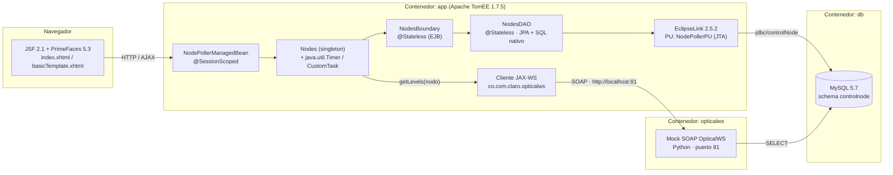

<h1 align="center">Centurión · NodePoller</h1>

<p align="center">
  Tablero web de monitoreo de <b>nodos ópticos</b> de la red HFC/DWDM de Claro Colombia.
  <br/>
  <sub>Java EE 6 · JSF/PrimeFaces · EJB · JPA/EclipseLink · Apache TomEE · MySQL · Docker</sub>
</p>

---

## 📑 Tabla de contenido

- [¿Qué hace la aplicación?](#-qué-hace-la-aplicación)
- [Arquitectura](#-arquitectura)
- [Stack tecnológico](#-stack-tecnológico)
- [Endpoints](#-endpoints)
- [Modelo de datos](#-modelo-de-datos)
- [Estructura del repositorio](#-estructura-del-repositorio)
- [Configuración](#-configuración)
- [Cómo ejecutar](#-cómo-ejecutar)  → ver **[RUNME.md](RUNME.md)** para el paso a paso
- [Build sin Docker](#-build-sin-docker)
- [Datos de ejemplo (semilla)](#-datos-de-ejemplo-semilla)
- [Solución de problemas](#-solución-de-problemas)

---

## 🛰 ¿Qué hace la aplicación?

`Centurión` (nombre interno del artefacto: **NodePoller**, `NodePoller.war`) es un panel de
operación que consolida, por **nodo óptico**:

| Vista | Descripción | Origen de datos |
|-------|-------------|-----------------|
| **Alarmas Registradas** | Tabla auto-refrescada (cada 180 s) con las alarmas activas (`ack = 2`), ordenadas por fecha desc. Exportable a Excel. | `OpticalNodealarm` (JPA named query) |
| **Buscar Nodo** | Ficha del nodo: SDS, región, ciudad, plataforma, transponder, modelo, chasis y slot de los caminos **Forward** y **Retorno**, con icono de estado (🟢 UP / 🔴 DOWN). | SQL nativo multi-join sobre `optical_*` |
| **Historial Forward / Retorno** | Series temporales de potencia/señal por slot. Exportable a Excel. | Tabla `optical_slotdata` |
| **Niveles (tiempo real)** | Diálogo con `fwdpwr`, `fwdinrf`, `retpwr`, `retarop` consultados en vivo. | WebService SOAP `OpticalWS.getLevels` |

---

## 🏗 Arquitectura



**Notas de despliegue**

- El EJB queda ligado en `java:global/NodePoller/NodesBoundary!...`; por eso el WAR **debe**
  desplegarse como `NodePoller.war` (contexto `/NodePoller`).
- `opticalws` comparte el *network namespace* del contenedor `app`
  (`network_mode: "service:app"`), de modo que la app lo alcanza en `http://localhost:81`,
  que es la URL compilada en el cliente JAX-WS (`wsimport -wsdllocation`).
- El *datasource* `jdbc/controlNode` se genera al arrancar (`docker/entrypoint.sh` →
  `envsubst` sobre `docker/tomee.xml.tpl`) con los valores de `config/centurion.env`.

---

## 🧰 Stack tecnológico

### Lenguajes

| Lenguaje | Uso | Versión |
|----------|-----|---------|
| **Java** | Aplicación (EJB, JSF backing beans, JPA) | 7 (source/target) · compilada con JDK 8 |
| **XHTML / Facelets** | Vistas JSF | JSF 2.1 |
| **SQL** | Esquema + semilla + consultas nativas | MySQL 5.7 |
| **Python** | Mock del WebService SOAP | 3.12 |
| **Bash** | Entrypoint del contenedor `app` | — |

### Frameworks y librerías (runtime del WAR)

| Componente | Versión | Origen | Motivo |
|-----------|---------|--------|--------|
| PrimeFaces | 5.3 | Maven Central | UI |
| PrimeFaces Extensions | 4.0.0 | Maven Central | `<pe:timer>` (auto-refresh) |
| Tema `blitzer` | 1.0.10 | `libs/` (no está en repos públicos) | `web.xml → primefaces.THEME` |
| Apache POI | 3.8 | Maven Central | Exportación a `.xls` (HSSF) |
| Gson | 2.2.2 | Maven Central | requerido por PrimeFaces Extensions |
| EclipseLink | 2.5.2 | Maven Central | Proveedor JPA (TomEE web sólo trae OpenJPA) |
| javax.persistence | 2.1.0 | Maven Central | API JPA 2.1 |

> Librerías del proyecto NetBeans original **eliminadas** por no usarse:
> `cron4j-2.2.5`, `itext-2.1.7`, y los `org.eclipse.persistence.*` sueltos
> (ya incluidos en el uber-jar `eclipselink`).

### Provisto por el contenedor de aplicación (scope `provided`)

`javaee-api 6.0` (JSF 2.1, EJB 3.1, CDI 1.0, JPA, Servlet 3.0, JAX-WS 2.2, JAXB, Bean
Validation, JTA) · `commons-lang3 3.3.2` · MyFaces 2.1.17 · `mysql-connector-java 5.1.49`.

### Herramientas

| Herramienta | Versión | Rol |
|-------------|---------|-----|
| **Apache TomEE** (web profile) | 1.7.5 | Servidor Java EE (OpenEJB 4.7.5 + MyFaces 2.1.17) |
| **MySQL** | 5.7 | Base de datos |
| **Maven** | 3.9 | Build del WAR (`pom.xml`) |
| **JDK** | 8 (Temurin) | Compilación + `wsimport` |
| **Docker / Docker Compose** | 20.10+ / v2 | Orquestación local |
| Apache Ant + NetBeans | 1.9 | Build legado (`build.xml`, `nbproject/`) — *se conserva, no se usa* |

### Bases de datos

| Motor | Esquema | Usuario | Puerto host | Volumen |
|-------|---------|---------|-------------|---------|
| MySQL 5.7 | `controlnode` | `centurion` / `centurion` (root: `rootpw`) | `3307` → `3306` | `centurion-dbdata` |

El esquema y la semilla se cargan **una sola vez** desde `db/init/*.sql`
(`persistence.xml` tiene `schema-generation = none`).

---

## 🌐 Endpoints

### HTTP (aplicación)

| Método | URL | Descripción |
|--------|-----|-------------|
| `GET` | `http://localhost:8080/NodePoller/` | Redirige a la vista principal |
| `GET` | `http://localhost:8080/NodePoller/faces/index.xhtml` | Vista principal (alarmas, buscador, historial) |
| `POST` | `.../faces/index.xhtml` | Peticiones AJAX de JSF (`javax.faces.partial.ajax`): `searchNode`, `findNodeInRealTime`, `loadAlarms`, `reLoad`, exportadores XLS |
| `GET` | `http://localhost:8080/NodePoller/faces/javax.faces.resource/*` | Recursos JSF (CSS, JS, imágenes, tema) |

### SOAP (`opticalws`, sólo alcanzable desde el contenedor `app` como `localhost:81`)

| Operación | Entrada | Salida | Uso |
|-----------|---------|--------|-----|
| `getLevels` | `node : string` | cadena `\|`-delimitada (≥13 campos; 10–13 = fwdpwr, fwdinrf, retpwr, retarop) | Botón **Niveles** |
| `getPosition` | `node : string` | `nodo\|lat\|lon\|` | (definida en el WSDL, sin uso en la vista) |
| `GET ?wsdl` | — | WSDL | Descubrimiento del cliente JAX-WS |

### Base de datos

| Recurso | Valor |
|---------|-------|
| JDBC URL (dentro de la red Docker) | `jdbc:mysql://db:3306/controlnode?useSSL=false` |
| JDBC URL (desde el host) | `jdbc:mysql://localhost:3307/controlnode` |
| DataSource JNDI (TomEE) | `jdbc/controlNode` (JTA) · unidad de persistencia `NodePollerPU` |

---

## 🗄 Modelo de datos

17 tablas `optical_*`. Las 16 mapeadas por entidades JPA
(`src/java/co/com/claro/nodepoller/entities/`) + **`optical_slotdata`** (sin entidad; sólo la
usan las consultas nativas de `NodesDAO`, por eso se crea a mano en `db/init/01-schema.sql`).

```
optical_region ─< optical_city ─< optical_sds ─< optical_chasis ─< optical_slot ─< optical_slotdata
                                        │                │              │
                              optical_configfile   optical_platform  optical_slottype
optical_node >── fwdslot_id / retslot_id ──> optical_slot
optical_node ─── state_id ──> optical_state ,  transponder_id ──> optical_transponder ──> optical_transponder_model
optical_nodealarm ─── alarmtype_id ──> optical_alarmtype ,  level_id ──> optical_level ,  state_id ──> optical_state
```

> ⚠️ `NodesDAO.findAlarm()` invoca `getAlarmtypeId().getName()` **sin** comprobar `null`:
> toda fila de `optical_nodealarm` debe tener `alarmtype_id` válido (la semilla lo garantiza).

---

## 📁 Estructura del repositorio

```
Centurion/
├── pom.xml                      # Build Maven (WAR) · dependencias por secciones
├── README.md · RUNME.md
├── docker-compose.yml           # db + app + opticalws
├── config/
│   └── centurion.env            # ← credenciales / URL de conexión (único archivo a tocar)
├── db/
│   └── init/
│       ├── 01-schema.sql        # 17 tablas optical_*
│       └── 02-seed.sql          # 5 regiones · 10 ciudades · 20 nodos · alarmas · historial
├── docker/
│   ├── app.Dockerfile           # multi-stage: Maven build → TomEE 1.7.5
│   ├── entrypoint.sh            # render de tomee.xml desde variables de entorno
│   ├── tomee.xml.tpl            # plantilla del DataSource jdbc/controlNode
│   └── opticalws/               # mock SOAP OpticalWS
│       ├── Dockerfile · server.py · OpticalWS.wsdl
├── libs/
│   └── blitzer-1.0.10.jar       # tema PrimeFaces (no disponible en Maven Central)
├── src/
│   ├── conf/persistence.xml     # PU NodePollerPU · provider EclipseLink · schema-gen none
│   └── java/co/com/claro/nodepoller/
│       ├── controller/  NodePollerManagedBean          (JSF, @SessionScoped)
│       ├── bussines/    Nodes                           (singleton + Timer)
│       ├── boundary/    NodesBoundary                   (EJB @Stateless)
│       ├── dao/         NodesDAO                        (EJB @Stateless, JPA + SQL nativo)
│       ├── entities/    Optical*.java  (16)             (JPA)
│       ├── dto/         NodeDTO · NodeDateDTO · NodeAlarmDTO
│       └── util/        Constants · CustomTask · BaseManagedBean · Document
├── web/
│   ├── index.xhtml · template/basicTemplate.xhtml
│   ├── WEB-INF/  web.xml · beans.xml · jax-ws-catalog.xml · wsdl/
│   └── resources/  css/ · img/ · font/
└── build.xml · nbproject/        # build Ant/NetBeans legado (no usado por Docker/Maven)
```

---

## ⚙️ Configuración

Todo vive en **`config/centurion.env`** (lo leen los 3 servicios vía `env_file`):

| Variable | Por defecto | Consumidor |
|----------|-------------|-----------|
| `MYSQL_ROOT_PASSWORD` / `MYSQL_DATABASE` / `MYSQL_USER` / `MYSQL_PASSWORD` | `rootpw` / `controlnode` / `centurion` / `centurion` | contenedor `db` + healthcheck |
| `DB_URL` | `jdbc:mysql://db:3306/controlnode?useSSL=false` | `entrypoint.sh` → `tomee.xml` |
| `DB_USER` / `DB_PASSWORD` | `centurion` / `centurion` | `entrypoint.sh` → `tomee.xml` |
| `DB_HOST` / `DB_PORT` / `DB_NAME` | `db` / `3306` / `controlnode` | mock `opticalws` |
| `OPTICALWS_PORT` | `81` | mock `opticalws` |

Para otro entorno: edita ese archivo (o crea una copia y ajústalo). No hay credenciales
en `docker-compose.yml` ni en el código.

---

## 🚀 Cómo ejecutar

Guía detallada paso a paso: **[RUNME.md](RUNME.md)**. Versión corta:

```bash
git clone <repo> && cd Centurion
docker compose up -d --build          # construye WAR + TomEE + MySQL + mock
# espera a que 'db' quede healthy y el WAR despliegue (primer arranque de MySQL puede tardar)
xdg-open http://localhost:8080/NodePoller/
```

Parar / limpiar:

```bash
docker compose down          # detiene y borra contenedores (conserva datos)
docker compose down -v       # además borra el volumen de MySQL (semilla se recarga)
```

---

## 🔨 Build sin Docker

Requisitos: **JDK 8** (aporta `wsimport`) y **Maven 3.6+**.

```bash
mvn clean package
# -> target/NodePoller.war   (desplegable en Apache TomEE 1.7.x web profile)
```

El `pom.xml`:

1. `maven-antrun-plugin` ejecuta `wsimport` sobre `web/WEB-INF/wsdl/.../OpticalWS.wsdl`
   con `-wsdllocation http://localhost:81/...` y deja las clases en `target/generated-sources/wsimport`.
2. `build-helper-maven-plugin` añade ese directorio como fuente.
3. `maven-compiler-plugin` compila `src/java` + stubs (Java 7).
4. `maven-war-plugin` empaqueta `web/` + `WEB-INF/classes` + `persistence.xml` en
   `META-INF/` + copia `libs/blitzer-1.0.10.jar` a `WEB-INF/lib`.

Para desplegar necesitas además: un `Resource id="jdbc/controlNode"` en `conf/tomee.xml`
(ver `docker/tomee.xml.tpl`) y `mysql-connector-java` en `tomee/lib/`.

---

## 🌱 Datos de ejemplo (semilla)

`db/init/02-seed.sql` genera:

- **5 regiones** · **10 ciudades** (Bogotá, Medellín, Cali, Barranquilla, Cartagena,
  Bucaramanga, Cúcuta, Pereira, Manizales, Ibagué).
- **2 plataformas**: `AURORA` y `ROSA` (rutan distinto el cálculo de "retorno").
- **20 nodos** = pareja `001` / `002` por ciudad:
  - `NODO<ciudad>001` → **UP** (🟢) — 12 nodos, valores de historial sanos.
  - `NODO<ciudad>002` → **DOWN** (🔴) en BOG/MED/CAL/BAQ/CTG/BUC · **UNMANAGED** en CUC/PEI ·
    **UP** en MZL/IBG.
- **40 slots** · **220 filas** de `optical_slotdata` (degradadas / `LOS` para nodos DOWN).
- **28 alarmas**: 24 visibles (`ack = 2`, repartidas por las 10 ciudades) + 4 ocultas (`ack = 1`).

**Recorrido de prueba**

| Acción | UP | DOWN |
|--------|----|----|
| Buscar Nodo | `NODOCAL001` → 🟢 + historial sano | `NODOCAL002` → 🔴 + historial degradado |
| Niveles | `NODOCAL001` → valores reales | `NODOCAL002` → `LOS / LOS / LOS / LOS` |

---

## 🩺 Solución de problemas

| Síntoma | Causa / solución |
|---------|------------------|
| `docker compose up` "colgado" en `db` *(health: starting)* | El primer arranque de MySQL 5.7 inicializa el datadir y corre la semilla; en discos lentos puede tardar varios minutos. `app` arranca sola cuando `db` queda *healthy*. |
| `404` en `http://localhost:8080/NodePoller/` | El WAR aún no ha desplegado o falló. `docker compose logs app` y buscar `SEVERE`. |
| Botón **Niveles** → "Error Consultando Niveles" | El contenedor `opticalws` no está arriba. `docker compose ps` / `docker compose logs opticalws`. |
| Tabla de alarmas vacía | La semilla no cargó. `docker compose down -v && docker compose up -d`. |
| Cambié `config/centurion.env` y no aplica | Recrear contenedores: `docker compose up -d --force-recreate`. |
| Puerto `3307` u `8080` ocupado | Cambiar el mapeo en `docker-compose.yml` (`ports:`). |
